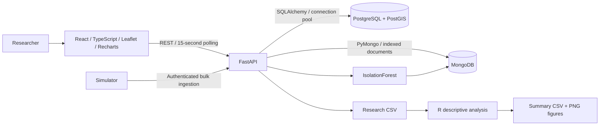

# FieldSense architecture

FieldSense is a single-lab research application. All included farms, people, coordinates and observations are simulated; this project has no claimed university adoption or scientific validation.

## Data ownership

PostgreSQL owns teams, users, researcher profiles, farms, fields, plots, crops, seasons, experiments, treatments, sensor types, instruments, deployments, weather observations, annotations and export audit records. Foreign keys constrain metadata relationships. PostGIS stores WGS84 field/plot polygons and instrument points with GiST indexes.

MongoDB owns heterogeneous device documents and readings, including original payloads, normalized values, event and receipt timestamps, missing-value flags and model annotations. Compound sensor/time indexes support recent observations and time windows; anomaly/time and timestamp indexes serve quality review and export. Stable string sensor IDs join observations to metadata through the service layer. Device-native payloads are retained, but ingestion requires a normalized envelope; adapters must supply measurement values and timezone-aware timestamps.

## Consistency and failure modes

There is no distributed transaction. Ingestion first validates all referenced sensors in PostgreSQL, then performs idempotent MongoDB upserts. Repeating a reading ID is first-write-wins; correction should use a new ID. Metadata deletion is not exposed, avoiding normal orphan creation. Administrators changing metadata directly must reconcile documents. A PostgreSQL outage prevents metadata validation; a MongoDB outage prevents reading access. Both surface as HTTP 503 without disclosing connection strings. A partial bulk failure can safely be retried with the original IDs.

Export audit records describe requested exports; a network interruption may prevent the client from receiving every recorded row. Model annotations live alongside their source observations so a reading and its current flag are updated atomically. A model run updates many documents and is not globally atomic; readers may briefly observe a partially completed run.

## Geospatial and time queries

`/api/map?bbox=west,south,east,north` uses `ST_Intersects` with a WGS84 envelope. `/api/fields/{id}/sensors` uses `ST_Covers`, including points on a field edge. Map responses cap each feature category at 2,000. Administrative systems with larger maps should add vector tiles and explicit continuation.

Relational filters first resolve sensor IDs, then constrain the MongoDB query. Chart queries aggregate in MongoDB using `$dateTrunc`, means, ranges, missing counts and anomalous counts. Responses above 6,000 buckets are rejected, rather than silently truncating. The UI shows up to six series and supports brush zoom, time filters and aggregation intervals. Raw tables are paginated and CSV streams in batches with a 500,000-row cap.

## Reliability and security boundary

Write routes require a constant-time checked bearer token, configured outside source control. Read routes intentionally expose simulated portfolio data. User/researcher records are profiles, not an implemented identity provider. This version does not provide per-user login, multi-tenant isolation or granular authorization. Deploy real or restricted research data only behind institutional SSO and an access gateway, with authorization added to every query.

Containers run on a private Compose network; database ports are not published. Backend runs as a nonroot user. Hosted configuration adds Caddy TLS and generates random lab/database credentials on the host. SQL connections pre-ping pooled connections. Health checks verify both databases and PostGIS. JSON access logs omit request bodies and authorization headers.

## Scaling and scientific limits

The dataset contains 192 instruments, but this is not a guarantee of production capacity. See measured benchmark evidence. Start with the supplied single-host deployment; separate PostgreSQL to RDS and MongoDB to Atlas for independent backups and capacity. Add a durable job queue before supporting large concurrent model fits and exports. No Redis cache is used; 15-second polling queries current storage.

IsolationForest fits up to the newest 10,000 nonmissing values per instrument, using 100 trees, contamination 0.025 and seed 42. It identifies univariate outliers, not agronomic diagnoses. Seasonality, calibration, soil/crop context and drift can confound results. The R pipeline computes descriptive summaries and treatment boxplots only; repeated sensor samples are not independent experimental replicates.

Reference semantics: [PostGIS ST_Covers](https://postgis.net/docs/ST_Covers.html), [ST_MakeEnvelope](https://postgis.net/docs/ST_MakeEnvelope.html), [MongoDB dateTrunc](https://www.mongodb.com/docs/v8.0/reference/operator/aggregation/datetrunc/), [FastAPI containers](https://fastapi.tiangolo.com/deployment/docker/).
