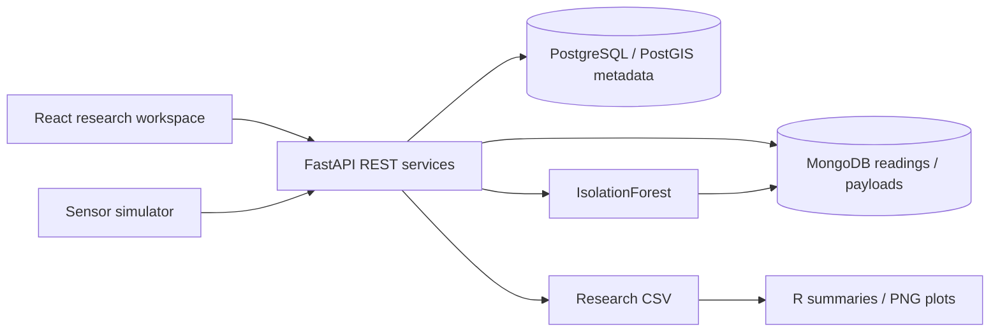

# FieldSense

**Digital agriculture research data platform**

A Python and React workspace for exploring sensor measurements, field geometry, experimental treatments and research exports. Designed around the day-to-day questions of agricultural researchers and graduate students: where is a sensor, what changed, is a reading unusual, and how can the data be analyzed reproducibly?

All seeded data and locations are simulated. This project does not claim university adoption, actual field deployment or scientifically validated anomaly detection.

## Start the application

```sh
docker compose up --build
```

Open **http://localhost:8080**. The stack starts PostgreSQL/PostGIS, MongoDB, FastAPI and React/nginx; migrations and first-run seeding are automatic. API documentation: http://localhost:8080/docs. For local write operations use the development token documented in `.env.example`. Change credentials before hosting.

## Research workflows

- Overview: active/offline instruments, field and plot counts, observations, anomaly flags and missing-value warnings; refreshes every 15 seconds.
- Field map: real GeoJSON field/plot polygons and instrument points, clickable metadata, spatial bounding-box and containment APIs.
- Time series: filters for farm, field, plot, crop, experiment, instrument, measurement and dates; server aggregation, multiple curves, brush zoom, hover and anomaly bucket markers.
- Instruments: coordinates, heterogeneous device metadata, deployment history, latest observations and on-demand IsolationForest fitting.
- Experiments: create trials with crop, season, dates and treatments; inspect associated plots and notes.
- Data explorer: timestamp ordering, bounded pagination, selectable quality columns and filtered streaming CSV exports.
- Research analysis: R descriptive summaries by experiment/treatment/plot/measurement and treatment distribution PNGs. Charts also support browser print/save PDF.

The seed covers 3 farms, 6 fields, 24 plots, corn/soybean/wheat, 6 experiments and 192 instruments across 60 days. Eight measurement types include soil moisture and temperature, air temperature, humidity, rainfall, canopy temperature, PAR and leaf wetness. Injected gaps, irregular intervals, null values, drift, spikes and offline periods exercise quality workflows.

## Technology and architecture

Python 3.12 · FastAPI · SQLAlchemy · Pydantic · Alembic · PostgreSQL 16/PostGIS · MongoDB 7 · scikit-learn · React 19 · TypeScript · Vite · Leaflet · Recharts · base R · Docker Compose · GitHub Actions · AWS/Terraform.



See [ARCHITECTURE.md](ARCHITECTURE.md) for the data model, hybrid storage rationale, consistency tradeoffs, indexes, spatial workflow, reliability and scaling limits.

## Ingest and analyze

```sh
docker compose exec backend python -m app.simulator
```

The simulator writes every 15 seconds and retries with stable reading IDs. Ingestion validates sensor identifiers, finite values, timezone-aware event timestamps and bounded batches; arbitrary raw device payloads are retained.

Example read APIs:

```sh
curl 'http://localhost:8080/api/readings?sensor=sensor-0-0-0&size=50&page=1'
curl 'http://localhost:8080/api/series?measurement=soil_moisture&hours=24'
curl 'http://localhost:8080/api/map?bbox=-83.081,40.039,-83.070,40.050'
curl 'http://localhost:8080/api/fields/field-0/sensors'
```

Export actual stored measurements for R (create `artifacts` first):

```sh
mkdir -p artifacts
curl --fail 'http://localhost:8080/api/exports/csv?measurement=soil_moisture' -o artifacts/readings.csv
docker compose --profile analysis run --rm analysis
```

Alternatively: `Rscript analysis/summarize.R artifacts/readings.csv artifacts/r`. Outputs include `plot-summary.csv` and measurement treatment PNGs. No external R packages are required. The summaries are descriptive; repeated sensor observations do not establish independent treatment replication.

IsolationForest uses 100 trees, 2.5% contamination and a fixed random seed, fitting at most 10,000 recent nonmissing values per instrument. Flags and scores are stored with the readings and appear in chart buckets. This is an exploratory quality aid, not a scientifically validated classifier or crop-management recommendation.

## Verification and deployment

See [CONTRIBUTING.md](CONTRIBUTING.md) for tests, lint and build commands; [BENCHMARKS.md](BENCHMARKS.md) for measured evidence and workload definitions; [DEPLOYMENT.md](DEPLOYMENT.md) for local operation and the AWS Terraform path. CI runs actual PostGIS/MongoDB API tests, model fitting, frontend tests/build, R export analysis and HTTP benchmarks.

## Scope and limitations

This is a single-lab, simulated-data research application. Profiles are modeled, but institutional login and per-user authorization are not implemented; writes use a lab token and reads are public. Do not expose restricted research data without an access gateway and query-level authorization. The supplied AWS path is single-host, not highly available. Add managed databases, tested backups, job workers and SSO for institutional operation.

Model runs are synchronous, CSV exports are capped at 500,000 rows, map categories at 2,000 features, and chart responses at 6,000 buckets. The UI shows at most six curves. Initial database seeding should run against empty volumes; cross-database setup is not atomic. No fabricated screenshot or deployment URL is included.
